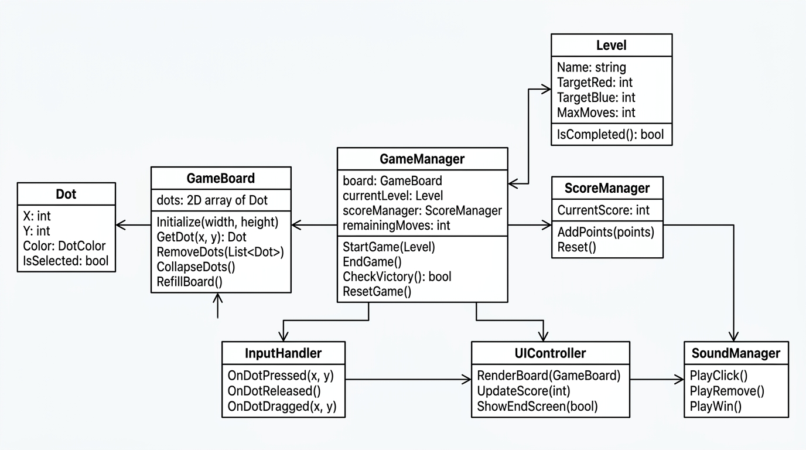

# TwoDots Clone (.NET MAUI for WinUI)

Ein einfacher Nachbau des beliebten mobilen Puzzlespiels *Two Dots*, entwickelt mit **.NET MAUI** für **Windows (WinUI)**.

## ?? Ziel des Spiels
Verbinde Punkte (Dots) derselben Farbe, um sie vom Spielfeld zu entfernen. Erreiche innerhalb einer vorgegebenen Anzahl von Zügen die Levelziele (z.?B. sammle 20 rote Punkte).

## ?? Features (geplant)
- Rasterbasiertes Spielfeld mit farbigen Punkten  
- Verbindung mehrerer Punkte durch Maus oder Touch  
- Entfernen, Nachrücken und Neugenerieren von Punkten  
- Punktezählung und Levelziele  
- Animierte UI mit .NET MAUI GraphicsView  
- (Später:) Power-Ups, Spezialpunkte, Soundeffekte, Speicherung

## ??? Klassenübersicht
- `GameManager`: Steuert den Spielfluss (Start, Ende, Sieg/Niederlage)  
- `GameBoard`: Kern der Spiellogik – Raster, Punktverbindungen, Nachrücken  
- `Dot`: Datenobjekt für jeden Punkt  
- `Level`: Levelparameter (Ziele, Bewegungen)  
- `ScoreManager`: Punktesystem und Auswertung  
- `InputHandler`: Eingabeverarbeitung (Touch/Maus)  
- `UIController`: UI-Aktualisierung und Darstellung  
- `SoundManager`: Effekte und Musik  
- `SaveManager` (optional): Fortschritt speichern/laden  

## UML-Klassendiagramm





## ??? Technische Hinweise
- **Framework:** .NET 8 MAUI (WinUI target)
- **UI:** XAML + GraphicsView (für Spielfeld)
- **Architektur:** MVVM?ähnlich, jedoch spielzentriert (Game?Loop gesteuert)
- **Sprache:** C#

## ?? Projektstart
1. Neues MAUI-Projekt erstellen:
   ```bash
   dotnet new maui -n TwoDotsClone
